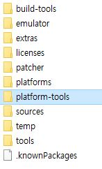
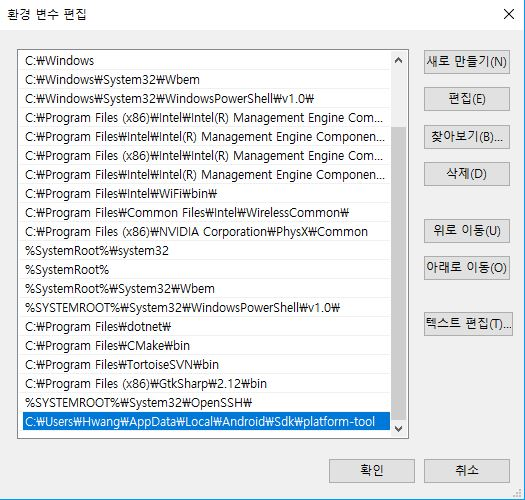
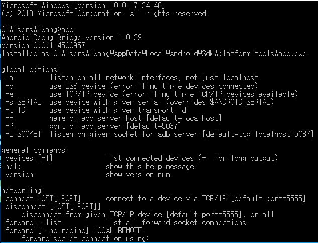

# adb

- adb(android debug bridge):  Android 기기와 통신 할 수 있는 다목적 명령줄. Unix Shell 접근 제공.
- client: 개발용 컴퓨터에 의해 실행됨.
- daemon: Android 기기에서 명령을 실행함
- server: client와 daemon 간의 통신 관리

 

## 설정

1. 환경 변수 설정

- adb.exe파일은 Android SDK 폴더의 plaform-tools폴더에 있다. 

- 환경변수에 추가

- cmd에서 adb실행파일을 바로 실행 할 수 있다.

2. 기기 개발자 옵션 활성화

 - [Android 개발자 옵션 활성화 방법](http://editorizer.tistory.com/224)

 

## adb 명령어

|명령어| 설명|
|---|---|
|adb devices| 기기 목록 출력|
|adb install *path_to_apk*|기기 목록 출력|
|adb pull *remote* *local*| 기기에 있는 파일이나 디렉토리를 복사|
|adb push *local* *Remote*|기기로 파일이나 디렉토리 복사|
|adb kill-server|서버 중지|
|instrument [options] *component*|component(package)를 모니터링 함. [-p file]은 프로파일링 데이터를 파일에 씀 |
|profile start *process file*|프로파일러 시작 및 결과를 file에 저장|
|profile stop process|프로파일러 중지|

 

## adb shell 명령어

|명령어| 설명|
|---|---|
|adb shell cmd pakage dump-profiles *pakage*|실행 프로파일 데이터 수집. 메서드, 클래스 정보를 알 수 있다.(생성경로: /data/misc/profman/*pakage*.txt)|
|adb shell dumpsys|시스템 데이터 덤프|
|dumpstate|상태를 파일에 덤프|
|logcat|시스템 및 앱 로깅을 활성화 하고 화면에 출력|

