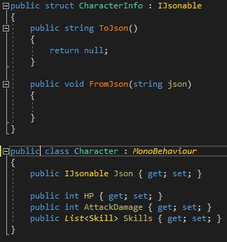
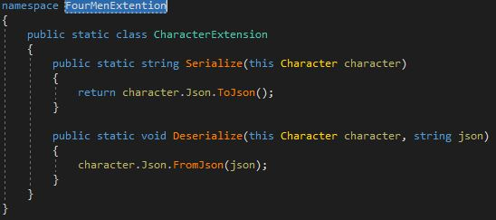

C#에 System.Linq 네임스페이스를 추가하면 아래과 같이 추가적으로 호출할 수 있는 메서드 목록들이 나옵니다.

위와 같은 메서드를 확장 메서드라고 합니다. 구현 방법으로는 아래와 같습니다.

1. 클래스를 선언합니다.

2. 해당 네임스페이스 안에 클래스에 대한 확장 메서드를 구현합니다.

3. 네임 스페이스 선언 후 확장 메서드를 호출할 수 있습니다. 네임스페이스는 있어도 되고 없어도 됩니다. 확장메서드가 네임스페이스 안에 들어 있지 않으면 바로 사용 가능합니다.

Character의 경우 Serialize함수를 멤버 함수로 구현하는 것은 객체지향개념에서는 벗어나는 것 같습니다(제 생각...^^). Character나 Monster는 Move나 Attack과 같은 함수만 존재하는것이 더 좋아보입니다. 이러한 경우 객체를 직렬화 해주는 Serialize 클래스를 구현하거나 확장 메서드를 구현하는 것이 더 좋아 보입니다.

추가적으로 함수 시그니처가 인터페이스 또는 클래스 메서드와 동일한 확장 메서드는 호출되지 않습니다. 컴파일 시간에 확장 메서드는 타입 내에서 정의된 메서드보다 우선 순위가 낮습니다.
