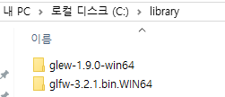
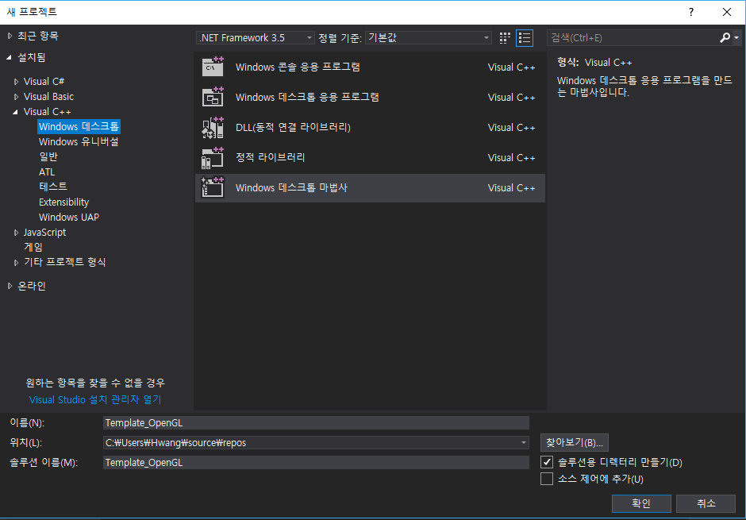
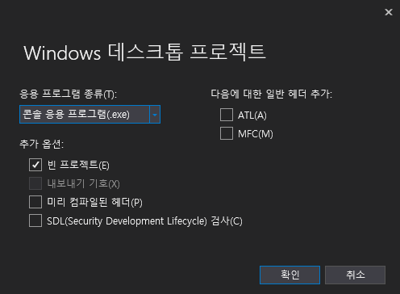
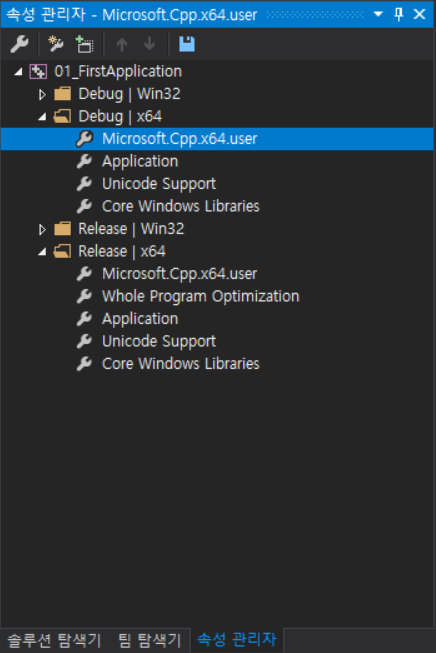
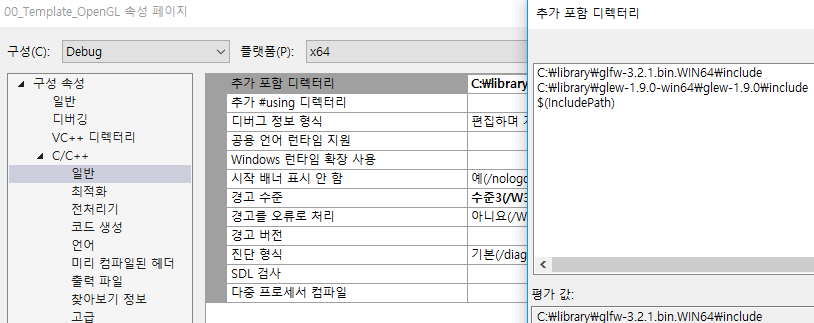
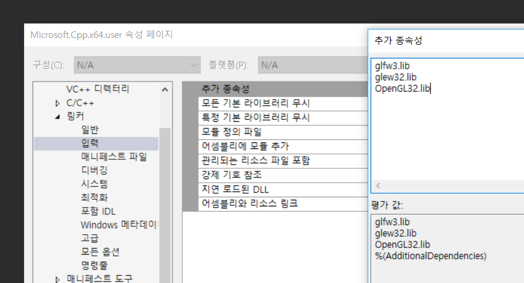

# 소개

## OpenGL이란?

: **그래픽스 서브시스템에 접근하고 제어하기 위한 API** 입니다.

## GLEW
: GLEW는 멀티플랫폼을 지원하는 C/C++ 확작 로딩 라이브러리입니다. OpenGL은 DX처럼 별도의 SDK가 존재하지 않으므로 OS에서 제공하는 버전을 사용해야합니다. Windows OS는 OpenGL 1.1을 제공합니다. 그 이상의 버전으로 개발을 할 수 있게 도와주는 것이 GLEW입니다. 

http://glew.sourceforge.net/

## GLFW
: OpenGL은 플랫폼 독립적인 API이기 때문에 Window생성 및 창 크기조절와 같은 인터페이스를 지원하지 않습니다. 따라서 플랫폼에 따른 작업들을 직접 구현하거나 라이브러리를 쓰는 방법이 있습니다. GLFW는 OpenGL ES, Vulkan 개발을 위한 멀티 플랫폼 라이브러리로 윈도우 생성, 컨텍스트 생성 등을 위한 간단한 API를 제공합니다. GLFW는 C로 쓰여있어서 Windows, maxOS, Unix 등 여러 시스템을 지원합니다.

   

http://www.glfw.org/

# 개발 환경 구축

1. GLEW, GLFW 다운

    

2. 프로젝트생성

    

    

3. 라이브러리 경로 설정. 프로젝트를 생성할때마다 하기 귀찮으므로 속성 관리자에서 설정하겠습니다.   [보기 - 다른 창 - 속성관리자] 열기

    

    [프로젝트 - 속성 - 일반 - 추가 포함 디렉터리]에 경로 추가

    

    [프로젝트 - 속성 - 링커 - 일반 - 추가 라이브러리 디렉터리]에 경로 추가

    

    [프로젝트 - 속성 - 링커 - 입력]에 라이브러리 추가

    

## 코드

<code>
		
	#include <GL/glew.h>
	#include <GLFW/glfw3.h>
	#include <iostream>

	void show_glfw_error(int error, const char* description) {
		std::cerr << "Error: " << description << '\n';
	}
	
	void window_resized(GLFWwindow* window, int width, int height) {
		std::cout << "Window resized, new window size: " << width << " x " << height << '\n';
	
		glClearColor(0, 0, 1, 1);
		glClear(GL_COLOR_BUFFER_BIT);
		glfwSwapBuffers(window);
	}
	
	void key_pressed(GLFWwindow* window, int key, int scancode, int action, int mods) {
		if (key == 'Q' && action == GLFW_PRESS) {
			glfwTerminate();
			exit(0);
		}
	}
	
	int main()
	{
		glfwSetErrorCallback(show_glfw_error);
	
		if (!glfwInit()) {
			exit(-1);
		}
		
		glfwWindowHint(GLFW_CONTEXT_VERSION_MAJOR, 3); 
		glfwWindowHint(GLFW_CONTEXT_VERSION_MINOR, 3);
		glfwWindowHint(GLFW_OPENGL_PROFILE, GLFW_OPENGL_CORE_PROFILE);
		glfwWindowHint(GLFW_OPENGL_FORWARD_COMPAT, GL_TRUE);	
	
		GLFWwindow* window = glfwCreateWindow(
			800, // width
			600, // height
			"OpenGL Example",
			NULL, NULL);
	
		if (!window)
		{
			glfwTerminate();
			exit(-1);
		}
	
		glfwMakeContextCurrent(window)
		glfwSetWindowSizeCallback(window, window_resized); 
		glfwSetKeyCallback(window, key_pressed);
	
		glfwSwapInterval(1);
	
		glewExperimental = GL_TRUE;
		GLenum err = glewInit();
		if (err != GLEW_OK) {			
			glfwTerminate();
			exit(-1);
		}
	
		glClearColor(0, 0, 1, 1);	
	
		while (!glfwWindowShouldClose(window)) {
	
			glClearColor(0, 0, 1, 1);
	
			glClear(GL_COLOR_BUFFER_BIT);
			glfwSwapBuffers(window);
			glfwPollEvents();
		}
	
	
		glfwDestroyWindow(window);
	
	
		glfwTerminate();
		return 0;
	}

</code>

## 함수

|함수명|설명|
|---|---|
|glfwInit()|glfw 라이브러리 초기화. glfw함수를 쓰기 전에 반드시 초기화 해야함.|
|glfwWindowHint|glfwCreateWindow를 호출하기 전에 윈도우 설정. 한번 설정되면 glfwWindowHint나 glfwDefaultWindowHints함수가 호출해서 변경하기 전까지 또는 라이브러리가 종료되기 전까지 남아있는다.|
|glfwTerminate|모든 윈도우들과 커서들을 파괴. 수정된 감마 램프를 되돌리고 모든 다른 리소스들을 해제함.|
|glfwMakeContextCurrent|window에 context를 생성. 쓰레드마다 하나의 컨텍스트 생성 가능. window가 context를 갖고 있지 않는 경우 GLFW\_NO\_WINDOW\_CONTEXT에러 발생.|
|glfwSetWindowSizeCallback| window의 크기를 세팅하는 콜백함수 등록. window가 resize될 때 함수가 호출됨.|
|glfwSetKeyCallback(window, key_pressed|window의 키를 세팅하는 콜백함수를 등록.|
|glfwSwapInterval|context의 swap interval를 지정. 버퍼를 바꾸고 반환하기 전에 glfwSwapBuffer함수를 호출하는데 몇몇 스크린은 업데이트를 하기 전에 이 과정을 기다린다. 이것을 수직동기화라고 한다.|
|glfwSwapBuffers|back buffer를 front buffer와 swap|
|glfwPollEvents| event queue에 있는 이벤트를 즉시 리턴한다. 이벤트는 윈도우에 의해 발생되고 등록된 콜백함수에 의해 처리된다.|
|glfwDestroyWindow|윈도우와 등록된 context를 파괴.|
|glewInit|GLEW 초기화|